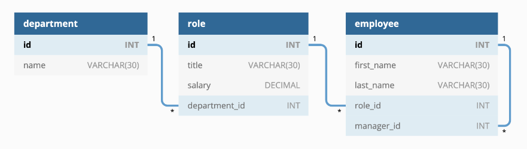
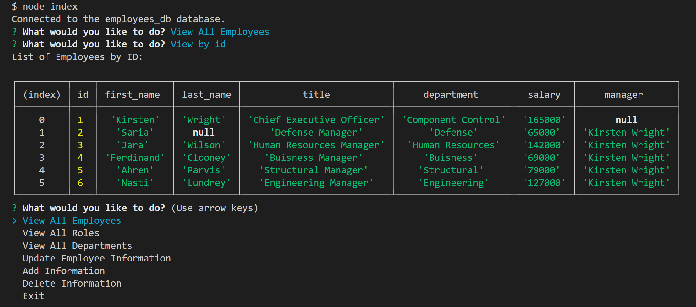

# Employee-Tracker

## Description
A content manager system to interact with an employee database using MYSQL and inquirer

## Table of Contents
- [Installation](#installation)
- [Usage](#usage)
- [License](#license)
- [Contributing](#contributing)
- [Contact](#contact)

## Installation
Download code from the GitHub repository. Have Node.js installed. Link to Node.js downloads: https://nodejs.dev/en/download/. In a terminal input npm init -y. Then in the terminal install inquirer version 8.2.4, dotenv, and mysql2 by inputting npm install.

## Usage
In a terminal the user should source their database. To connect the database to the application, the user should change the data in .env.EXAMPLE to their use information and remove the .EXAMPLE part from the file name.

The structure of the sql database will be diplayed in this photo:

Aftewerwards the user can start the application by entering node index. They wil be presented with a menu with  View ALll Employees, View All Roles, View All Departments, Update Employee Information, Add Information, Delete Information, View Department Budgets, and Exit. The user may have to scroll in order to see all the options. Choosing exit will close the application. View All Employees, Update Employee Information, Add Information, and Delete Information all have sub menus. All have a back option which will show the main menu again.

View All Employees can be viewd by id, manager, department. All the column information will bepresented in the same location, but the order of the information will be displayed by the option chosen.

When adding, updating, and deleting the user must enter numbers on data like ids and salaries. The user will have to edit their response until it is a number. When adding data that has foreign keys, it will fail if the foreign keys are invalid. Employee last name is allowed to be null because not everyone has a last name. Other ids and names are set to not null.

The view budgets is the combined salaries of all employees for their respective department.

## License
 This application is covered under MIT License.

You can click on the badge for further information.

## Contributing
Node.js (download here: https://nodejs.dev/en/download/)

Packages used: mysql2, dotenv, and inquirer (vers. 2.8.4)

## Contact
GitHub profile: https://github.com/CYMcolor